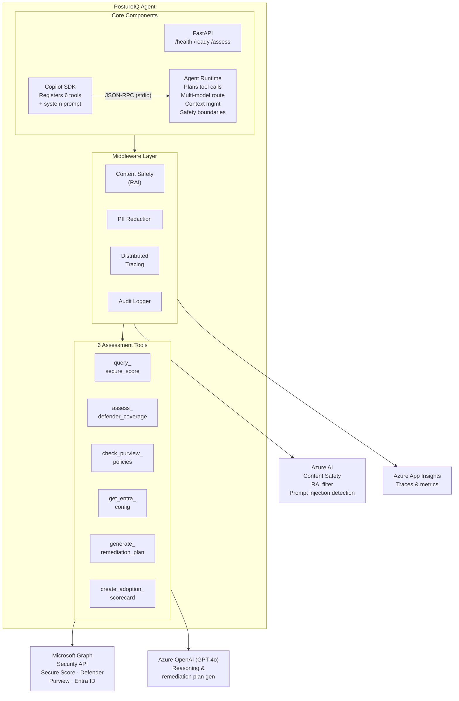
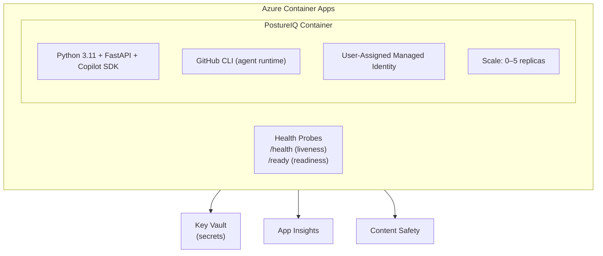
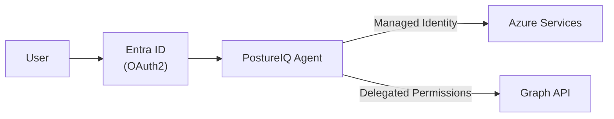

# PostureIQ — Architecture

## High-Level Architecture

```mermaid
graph TB
    subgraph Agent["PostureIQ Agent"]
        direction TB
        subgraph Core["Core Components"]
            direction LR
            FastAPI["FastAPI<br/>/health /ready /assess"]
            SDK["Copilot SDK<br/>Registers 6 tools<br/>+ system prompt"]
            Runtime["Agent Runtime<br/>Plans tool calls<br/>Multi-model route<br/>Context mgmt<br/>Safety boundaries"]
            SDK -- "JSON-RPC (stdio)" --> Runtime
        end

        subgraph Middleware["Middleware Layer"]
            direction LR
            ContentSafety["Content Safety<br/>(RAI)"]
            PII["PII Redaction"]
            Tracing["Distributed<br/>Tracing"]
            AuditLog["Audit Logger"]
        end

        subgraph Tools["6 Assessment Tools"]
            direction LR
            SecureScore["query_<br/>secure_score"]
            Defender["assess_<br/>defender_coverage"]
            Purview["check_purview_<br/>policies"]
            Entra["get_entra_<br/>config"]
            Remediation["generate_<br/>remediation_plan"]
            Scorecard["create_adoption_<br/>scorecard"]
        end

        Core --> Middleware --> Tools
    end

    Tools --> Graph["Microsoft Graph<br/>Security API<br/>Secure Score · Defender<br/>Purview · Entra ID"]
    Tools --> OpenAI["Azure OpenAI (GPT-4o)<br/>Reasoning &<br/>remediation plan gen"]
    Middleware --> ContentSafetyAPI["Azure AI<br/>Content Safety<br/>RAI filter<br/>Prompt injection detection"]
    Middleware --> AppInsights["Azure App Insights<br/>Traces & metrics"]
```

## Deployment Architecture

```mermaid
graph TB
    subgraph ACA["Azure Container Apps"]
        subgraph Container["PostureIQ Container"]
            P1["Python 3.11 + FastAPI + Copilot SDK"]
            P2["GitHub CLI (agent runtime)"]
            P3["User-Assigned Managed Identity"]
            P4["Scale: 0–5 replicas"]
        end
        Probes["Health Probes<br/>/health (liveness)<br/>/ready (readiness)"]
    end

    ACA --> KV["Key Vault<br/>(secrets)"]
    ACA --> AI["App Insights"]
    ACA --> CS["Content Safety"]
```

## Auth Flow

```mermaid
graph LR
    User --> EntraID["Entra ID<br/>(OAuth2)"]
    EntraID --> Agent["PostureIQ Agent"]
    Agent -- "Managed Identity" --> Azure["Azure Services"]
    Agent -- "Delegated Permissions" --> GraphAPI["Graph API"]
```
