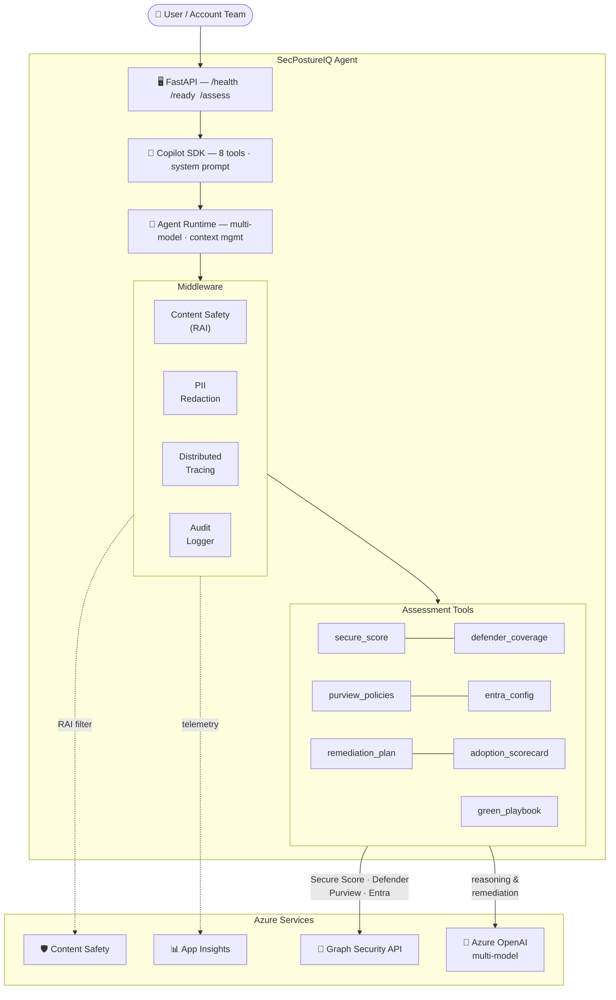
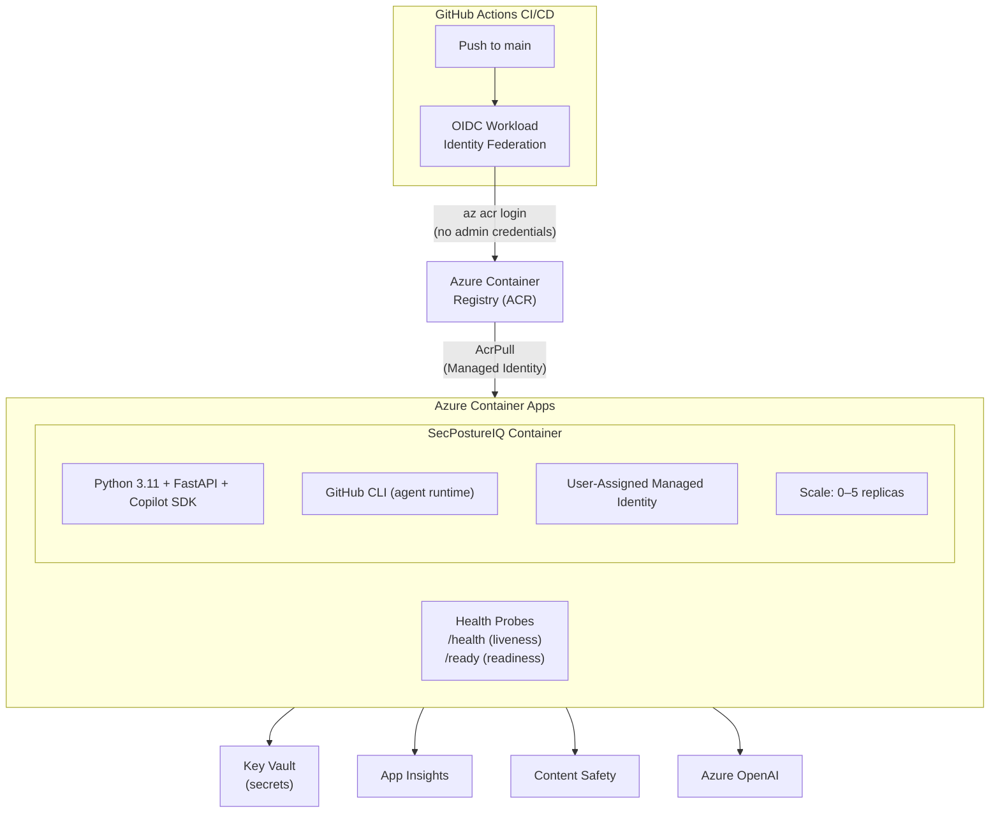
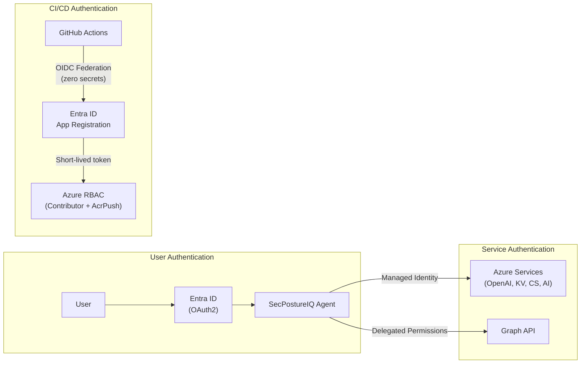

# SecPostureIQ — Architecture

## High-Level Architecture

```mermaid
flowchart TB
    User(["👤 User / Account Team"])

    subgraph AGENT ["SecPostureIQ Agent"]
        direction TB
        API["🖥️ FastAPI — /health  /ready  /assess"]
        SDK["🤖 Copilot SDK — 8 tools · system prompt"]
        RT["🧠 Agent Runtime — multi-model · context mgmt"]

        API --> SDK --> RT

        subgraph MW ["Middleware"]
            direction LR
            CS_MW["Content Safety\n(RAI)"]
            PII["PII\nRedaction"]
            TR["Distributed\nTracing"]
            AL["Audit\nLogger"]
        end

        subgraph TOOLS ["Assessment Tools"]
            direction LR
            T1["secure_score"] --- T2["defender_coverage"]
            T3["purview_policies"] --- T4["entra_config"]
            T5["remediation_plan"] --- T6["adoption_scorecard"]
            T7["green_playbook"]
        end

        RT --> MW --> TOOLS
    end

    subgraph AZURE ["Azure Services"]
        direction LR
        CSAPI["🛡️ Content Safety"]
        APPINS["📊 App Insights"]
        GRAPH["🔐 Graph Security API"]
        OPENAI["💬 Azure OpenAI\nmulti-model"]
    end

    User --> API
    MW -.->|"RAI filter"| CSAPI
    MW -.->|"telemetry"| APPINS
    TOOLS -->|"Secure Score · Defender\nPurview · Entra"| GRAPH
    TOOLS -->|"reasoning &\nremediation"| OPENAI
```

## Deployment Architecture

```mermaid
graph TB
    subgraph CICD["GitHub Actions CI/CD"]
        GH["Push to main"]
        OIDC["OIDC Workload<br/>Identity Federation"]
        GH --> OIDC
    end

    OIDC -- "az acr login<br/>(no admin credentials)" --> ACR["Azure Container<br/>Registry (ACR)"]

    subgraph ACA["Azure Container Apps"]
        subgraph Container["SecPostureIQ Container"]
            P1["Python 3.11 + FastAPI + Copilot SDK"]
            P2["GitHub CLI (agent runtime)"]
            P3["User-Assigned Managed Identity"]
            P4["Scale: 0–5 replicas"]
        end
        Probes["Health Probes<br/>/health (liveness)<br/>/ready (readiness)"]
    end

    ACR -- "AcrPull<br/>(Managed Identity)" --> ACA
    ACA --> KV["Key Vault<br/>(secrets)"]
    ACA --> AI["App Insights"]
    ACA --> CS["Content Safety"]
    ACA --> OAI["Azure OpenAI"]
```

## Auth Flow

```mermaid
graph LR
    subgraph UserAuth["User Authentication"]
        User --> EntraID["Entra ID<br/>(OAuth2)"]
        EntraID --> Agent["SecPostureIQ Agent"]
    end

    subgraph ServiceAuth["Service Authentication"]
        Agent -- "Managed Identity" --> Azure["Azure Services<br/>(OpenAI, KV, CS, AI)"]
        Agent -- "Delegated Permissions" --> GraphAPI["Graph API"]
    end

    subgraph CICDAuth["CI/CD Authentication"]
        GitHub["GitHub Actions"] -- "OIDC Federation<br/>(zero secrets)" --> EntraApp["Entra ID<br/>App Registration"]
        EntraApp -- "Short-lived token" --> AzureRBAC["Azure RBAC<br/>(Contributor + AcrPush)"]
    end
```
